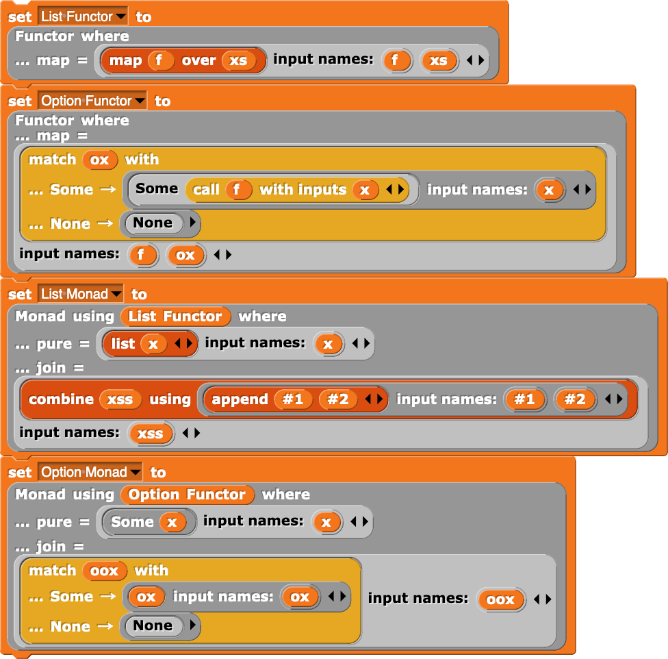
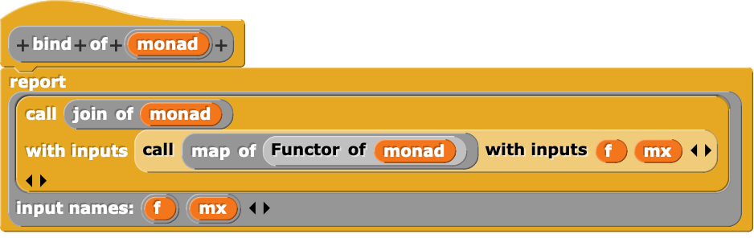
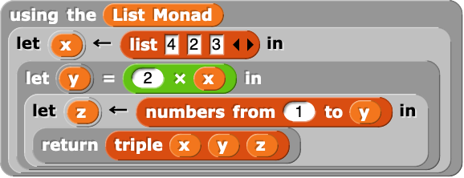
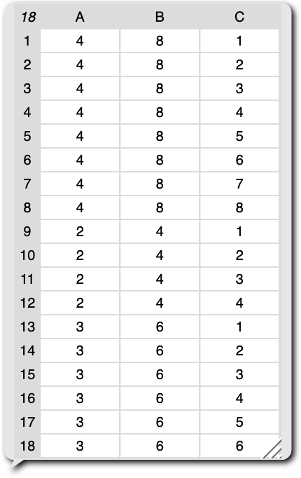

[Snap*!*](https://snap.berkeley.edu/) is one of the most widely-used programming
languages whose primary editor is entirely block-based.
For a while, I was skeptical of its expressive capabilities,
but, after finally playing around with it myself, I realized that it has support
for some extremely expressive constructs that allow for embedded domain-specific
languages.
As part of
[Sarah Chasins](https://schasins.com/)'s
[CS 294: Building User-Centered Programming Tools](http://schasins.com/cs294-usable-programming-2020/)
class, I implemented a *monadic do* construct in Snap*!*, similar to
[monadic do notation in Haskell](https://en.wikibooks.org/wiki/Haskell/do_notation)
and
[binding operators in OCaml](https://caml.inria.fr/pub/docs/manual-ocaml/bindingops.html).

I explain more about how this construct works in the rest of this post, but if
you want to mess around with it live, you can do so
[here](https://snap.berkeley.edu/snap/snap.html#present:Username=justinlubin&ProjectName=monadic-do&editMode&noRun)!

# Implementation

To implement a *monadic do* construct, I had to implement three main features,
each of which builds off the previous.

## Feature 1: Functor and Monad Typeclasses

First, I introduced a blocks that allows for the definition of "anonymous"
functor insances:

\

As well as one for anonymous monad instances:

\

These blocks can be used to create typeclass instances that can be assigned to
a variable using a normal Snap*!* *set* block:

\

Under the hood, I represent typeclasses as a product of functions, akin to
[dictionary passing](http://okmij.org/ftp/Computation/typeclass.html#dict).
I also provide "getter" blocks that simply return the correct function in a
given typeclass dictionary:

\

As well as "typeclass functions" such as *bind* for the monad typeclass that
operate on arbitrary monads using these getters:

\

## Feature 2: Monadic "Using" Notation

I then introduced a block that allows its subexpressions to use a particular
monad implicitly:

It works by setting the global variable `current monad` to the supplied monad,
running the block's subexpression, and resetting `current monad` to its previous
value:

\

For example, using this block, I implemented a `return` block that simply
calls the `pure` function of `current monad` with a given argument:

\

## Feature 3: Monadic Let Bindings

Lastly, I introduced monadic let bindings akin to `x <- mx` in Haskell
and `let* x = mx in …` in OCaml, which are sugar for the monadic bind operation:

\

These blocks only work in a "using" block because they rely on `current monad`
being set to access its *bind* function.
To implement this block, I used Snap*!*'s upvars, which, rather than *consuming*
the value of a variable passed in by a user, instead *provides* a variable
to the consumer of the block.
This was a bit tricky because it mean that I had to rely on mutation to set this
provided variable properly, which is not how typical *monadic do*
implementations desugar.
In particular, I treat the body of the monadic let
binding as an uninterpreted expression and perform the following desugaring:

::: {.center}
`let* x = mx in body` ↝ `mx >>= (fun output -> (x := output; body))`
:::

Which, in Snap*!*, looks like this:

\

## Conveniences

I also introduced an "option" (i.e. explicitly nullable) type implemented
under-the-hood as a singleton list:

\

Pattern matching for options and lists:

\

\

And *pure* let bindings to complement monadic let bindings:

\

# An Example

Using the list monad (which simulates a collection semantics for
nondeterministic choice), I implemented a simple procedure that
"nondeterministically" chooses a variable `x` from the list `[4, 2, 3]`, then
(purely) sets `y` to twice the value of `x`, then "nondeterministically" chooses
`z` from the list `[1, 2, …, y]`, and finally returns the triple `(x, y, z)`:

\

When run, this program returns all possible outputs of the procedure just
described:

\
