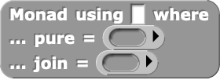

[Snap*!*](https://snap.berkeley.edu/) is one of the most widely-used programming
languages whose primary editor is entirely block-based.
For a while, I was skeptical of its expressive capabilities,
but, after finally playing around with it myself, I realized that it has support
for some extremely expressive constructs that enable embedded domain-specific
languages.
As part of
[Sarah Chasins](https://schasins.com/)'s
[CS 294: Building User-Centered Programming Tools](http://schasins.com/cs294-usable-programming-2020/)
class, I implemented a *monadic do* construct in Snap*!*, similar to
[monadic do notation in Haskell](https://en.wikibooks.org/wiki/Haskell/do_notation)
and
[binding operators in OCaml](https://caml.inria.fr/pub/docs/manual-ocaml/bindingops.html).

I explain more about how this construct works in the rest of this post (along
with an example), but if you want to mess around with it live, you can do so
[here](https://snap.berkeley.edu/snap/snap.html#present:Username=justinlubin&ProjectName=monadic-do&editMode&noRun)!

# Implementation

To implement a *monadic do* construct, I had to implement three main features,
each of which builds off the previous.

## Feature 1: Functor and Monad Typeclasses

First, I introduced blocks that allow for the definition of "anonymous"
functor and monad instances:

::: {.distribute}

:::

These blocks can be used to create typeclass instances that can be assigned to
a variable using a normal Snap*!* *set* block:

\

Under the hood, I represent typeclasses as a product of functions, akin to
[dictionary passing](http://okmij.org/ftp/Computation/typeclass.html#dict).
I also provide "getter" blocks that simply return the correct function in a
given typeclass dictionary:

::: {.distribute}

:::

Using these getters, I implemented some "typeclass functions" such as *bind* for
for arbitrary monads:

::: {.distribute}
\
:::

Unfortunately, these functions require explicitly passing in the monad as an
argument. Let's get around that limitation with this next feature!

## Feature 2: Monadic "Using" Notation

As the next step toward a nice *monadic do* construct, I introduced a block that
allows its subexpressions to use a particular monad *implicitly*:

\

It works by setting the global variable `current monad` to the supplied monad,
running the block's subexpression, and resetting `current monad` to its previous
value.
For example, using this block, I implemented a *return* block that simply
calls the *pure* function of `current monad` with a given argument:

\

## Feature 3: Monadic Let Bindings

Lastly, I introduced monadic let bindings akin to `x <- mx` in Haskell
and `let* x = mx in …` in OCaml, which are sugar for the monadic bind operation:

\

These blocks only work in a *using* block because they rely on `current monad`
being set properly (so that they can access its *bind* function).

To implement this block, I used an *upvar*, a surprisingly versatile Snap*!*
construct that, rather than *consuming* the value of a variable passed in by a
user, instead *provides* a variable to the user.
(As an aside, I've found upvars to be a fantastic use of interesting/atypical
programming language theory tailored to a specific domain that actually improves
the developer experience.)

Using an upvar turned out to be a bit tricky in this context because it meant
that I had to rely on mutation to set this provided variable properly, which is
not how typical *monadic do* implementations desugar.  In particular, I treat
the body of the monadic let binding as an uninterpreted expression and perform
the following desugaring:

::: {.center}
`let* x = mx in body` ↝ `mx >>= (fun output -> (x := output; body))`
:::

Which, in Snap*!*, looks like this:

\

## Conveniences

To make the *monadic do* syntax more meaningful to work with, I introduced an
"option" (i.e. nullable) type implemented under-the-hood as a singleton list:

::: {.distribute}

:::

I also implemented pattern matching for options and lists:

::: {.distribute}

:::

And, finally, I implemented *pure let bindings* to complement monadic let
bindings:

\

# An Example

Using the list monad (which simulates a collection semantics for
nondeterministic choice), I implemented a simple procedure that

1. "Nondeterministically" chooses a variable `x` from the list `[4, 2, 3]`, then
1. (Purely) sets `y` to twice the value of `x`, then
1. "Nondeterministically" chooses `z` from the list `[1, 2, …, y]`, and finally
1. Returns the triple `(x, y, z)`:

\

When run, this program returns all possible outputs of the procedure just
described:

\
